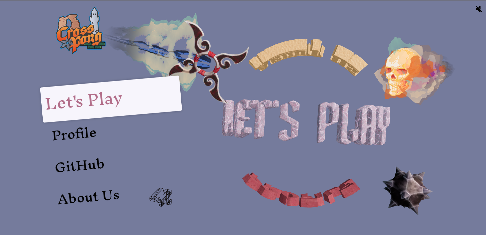
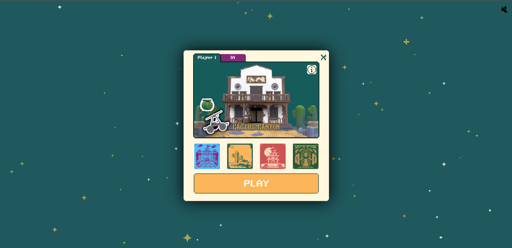
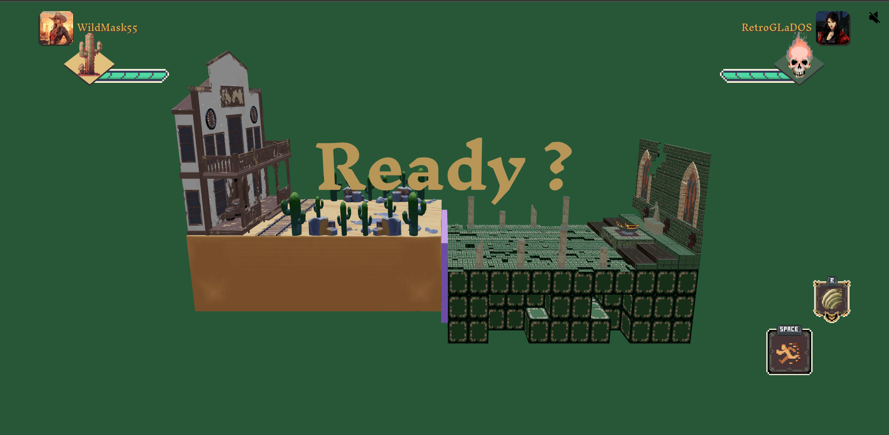
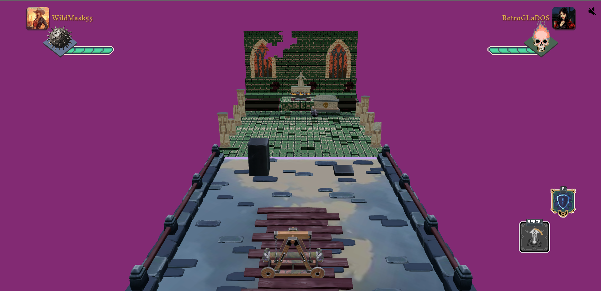

# CrossPong# CrossPong

Welcome to CrossPong! This project is a delightful rendition of the classic Pong game, developed as our final year student project. It's a testament to the joy of simple, engaging gameplay and the added twist of modern web technologies.

## About the Project

CrossPong expands on the classic Pong experience with four unique maps, each representing a half-court. When combined with an opponent's half, they form a complete playing field. Each map is distinct, with its own theme and custom game elements like balls, paddles, and special powers, enriching the traditional Pong formula.

## Screenshots

### Menu Interface

### Map Selection

### Intro Screen

### In-Game Experience

## Built With

- **React TypeScript**: Our framework of choice for building a structured and scalable web application.
- **Three Fiber**: This React renderer for Three.js brings our 3D elements to life.
- **GSAP**: For fluid and responsive animations, we've implemented the GSAP library.
- **P2.js**: The game's physics are driven by this robust JavaScript library.
- **XState**: We manage the game's state transitions and logic with the help of XState.

## Features

- **Single and Multiplayer**: Whether you're playing against the AI or with a friend, CrossPong offers a fun experience for all.
- **Themed Maps**: Choose from several maps, each offering a unique aesthetic and gameplay challenge.
- **Customized Gameplay**: Different balls, paddles, and powers keep the game fresh and exciting.
- **Advanced State Management**: Thanks to XState, the game runs smoothly and consistently.

## Play Online

Dive into the CrossPong experience online at [https://cross-pong.vercel.app/](https://cross-pong.vercel.app/).

## Acknowledgements

- [React Three Fiber](https://github.com/pmndrs/react-three-fiber)
- [GSAP](https://greensock.com/gsap/)
- [P2.js](https://schteppe.github.io/p2.js/)
- [XState](https://xstate.js.org/)
- 42 Paris

## Team

- Adnan Boudjelal
- Ludivine Novillo
- Vincent Luu

We are immensely grateful to Vincent for his help with the 3D models, which have significantly enhanced the visual appeal of CrossPong.

## License

This project is open source and available under the [MIT License](LICENSE).

## Contact

- Adnan Boudjelal - aboudjel@student.42.fr
- Ludivine Novillo - lunovill@student.42.fr

Thank you for checking out CrossPong. We hope it brings you as much fun as it brought us in making it!
