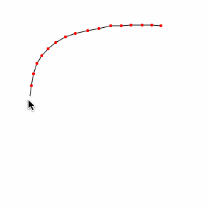

# poly-decomp-es

This is a maintained fork of poly-decomp.js, originally created by Stefan Hedman @schteppe.

`poly-decomp-es` is a library for decomposing a 2D polygon into convex pieces.

```
yarn add poly-decomp-es
```



[**Launch the demo!**](https://poly-decomp-es.vercel.app/)

The library implements two algorithms, one optimal (but slow) and one less optimal (but fast).

It's is a manual port of the C++ library [Poly Decomp](https://mpen.ca/406/bayazit) by [Mark Penner](https://mpen.ca).

### Basic usage

```js
import { decomp, makeCCW, quickDecomp } from 'poly-decomp-es'

// Create a concave polygon
const concavePolygon = [
  [-1, 1],
  [-1, 0],
  [1, 0],
  [1, 1],
  [0.5, 0.5],
]

// Make sure the polygon has counter-clockwise winding. Skip this step if you know it's already counter-clockwise.
makeCCW(concavePolygon)

// Decompose into convex polygons, using the faster algorithm
const convexPolygons = quickDecomp(concavePolygon)

// ==> [  [[1,0],[1,1],[0.5,0.5]],  [[0.5,0.5],[-1,1],[-1,0],[1,0]]  ]

// Decompose using the slow (but optimal) algorithm
const optimalConvexPolygons = decomp(concavePolygon)

// ==> [  [[-1,1],[-1,0],[1,0],[0.5,0.5]],  [[1,0],[1,1],[0.5,0.5]]  ]
```

### Advanced usage

```js
import { isSimple, makeCCW, quickDecomp } from 'poly-decomp-es'

// Get user input as an array of points.
const polygon = getUserInput()

// Check if the polygon self-intersects
if (isSimple(polygon)) {
  // Reverse the polygon to make sure it uses counter-clockwise winding
  makeCCW(polygon)

  // Decompose into convex pieces
  const convexPolygons = quickDecomp(polygon)

  // Draw each point on an HTML5 Canvas context
  for (let i = 0; i < convexPolygons.length; i++) {
    const convexPolygon = convexPolygons[i]

    ctx.beginPath()
    const firstPoint = convexPolygon[0]
    ctx.moveTo(firstPoint[0], firstPoint[1])

    for (let j = 1; j < convexPolygon.length; j++) {
      const point = convexPolygon[j]
      const x = point[0]
      const y = point[1]
      c.lineTo(x, y)
    }
    ctx.closePath()
    ctx.fill()
  }
}
```

### Documentation

#### type Point = [number, number]

#### type Polygon = Point[]

#### quickDecomp(polygon: Polygon): Polygon[]

```js
import { quickDecomp } from 'poly-decomp-es'

const convexPolygons = quickDecomp(polygon)
```

Slices the polygon into convex sub-polygons, using a fast algorithm. Note that the input points objects will be re-used in the result array.

If the polygon is not simple, the decomposition will produce unexpected results.

#### decomp(polygon: Polygon): Polygon[] | false

```js
import { decomp } from 'poly-decomp-es'

const convexPolygons = decomp(polygon)
```

Decomposes the polygon into one or more convex sub-polygons using an optimal algorithm. Note that the input points objects will be re-used in the result array.

Returns false if the decomposition fails.

#### isSimple(polygon: Polygon): boolean

```js
import { isSimple, quickDecomp } from 'poly-decomp-es'

if (isSimple(polygon)) {
  // Polygon does not self-intersect - it's safe to decompose.
  const convexPolygons = quickDecomp(polygon)
}
```

Returns true if the polygon does not self-intersect. Use this to check if the input polygon is OK to decompose.

#### makeCCW(polygon: Polygon): void

```js
import { makeCCW } from 'poly-decomp-es'

console.log('Polygon with clockwise winding:', polygon)
makeCCW(polygon)
console.log('Polygon with counter-clockwise winding:', polygon)
```

Reverses the polygon, if its vertices are not ordered counter-clockwise. Note that the input polygon array will be modified in place.

#### removeCollinearPoints(polygon: Polygon, thresholdAngle = 0): void

```js
import { removeCollinearPoints } from 'poly-decomp-es'

const before = polygon.length
removeCollinearPoints(polygon, 0.1)
const numRemoved = before - polygon.length
console.log(numRemoved + ' collinear points could be removed')
```

Removes collinear points in the polygon. This means that if three points are placed along the same line, the middle one will be removed. The `thresholdAngle` is measured in radians and determines whether the points are collinear or not. Note that the input array will be modified in place.

#### removeDuplicatePoints(polygon: Polygon, precision = 0): void

```js
import { removeDuplicatePoints } from 'poly-decomp-es'

const polygon = [
  [0, 0],
  [1, 1],
  [2, 2],
  [0, 0],
]
removeDuplicatePoints(polygon, 0.01)

// polygon is now [[1,1],[2,2],[0,0]]
```
